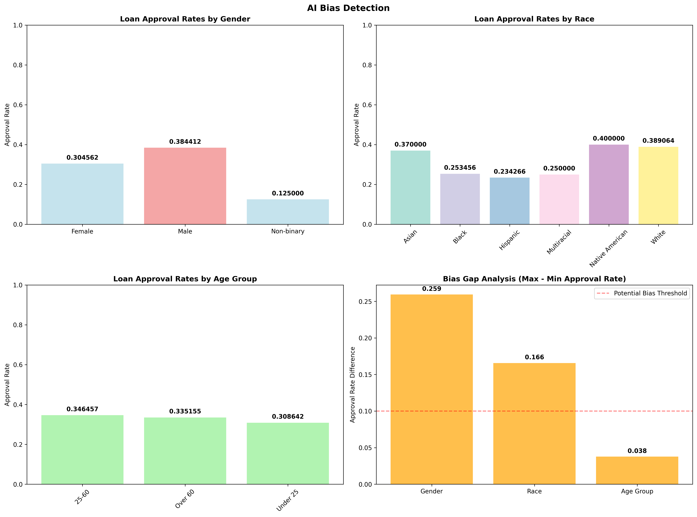
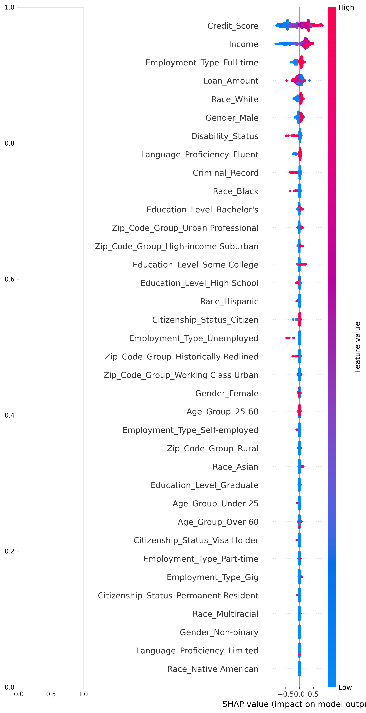
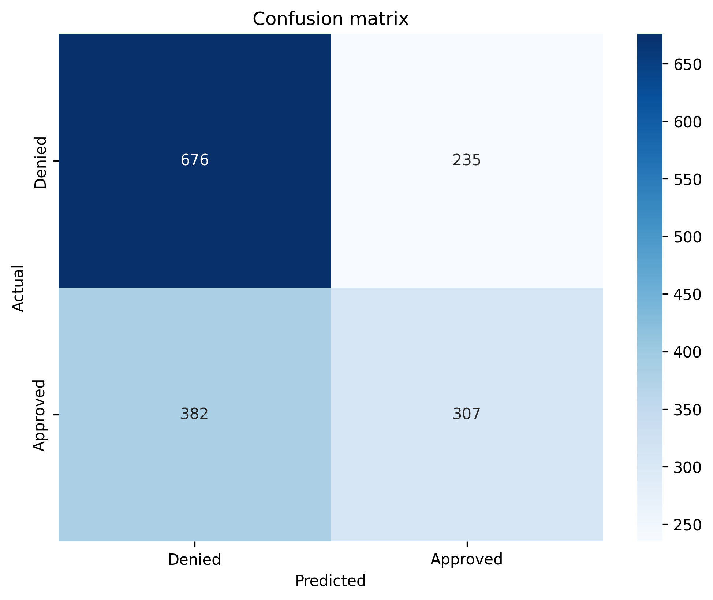
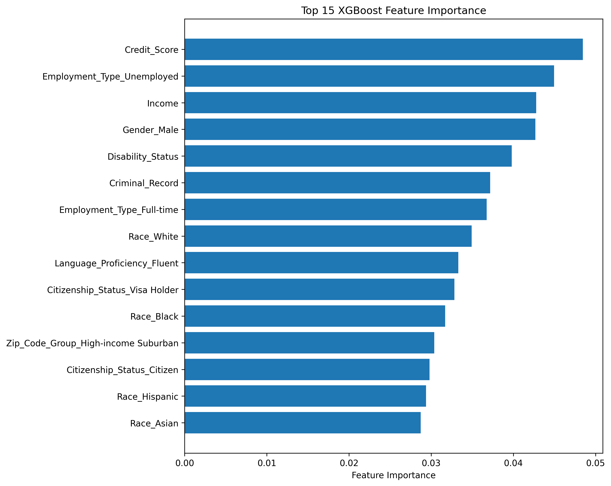

# HackTheFest AI Bias Hackathon

## Project Overview

This project was developed for the AI Bias Hackathon to investigate, test, detect and report algorithimic bias and fairness in a loan approval model. Using SHAP, fairness metrics and visualization techniques, we evaluated potential bias and discrimination in the dataset with a focus on sensitive attributes like gender and race.

## Methodology

- **Data Loading and Prepocessing**

  - Cleaned and prepare the dataset for modelling
  - Encoded categorical variables

- **Model Training**

  - Used Random Forest Classifier to predict loan approval

- **Bias Detection**

  - Conducted SHAP value analytics for feature importance and potential discriminatory attributes.
  - Conducted fairness metrics

- **Bias Visualization**

  - Generated SHAP summary plots and group-based fairness visualizations.

## Key Findings

- **Disparity in Approval Rates**:
  sensitive groups showed unequal approval rates, indicating potential bias.

- **SHAP Interpretability**:
  SHAP plots highlighted "gender" and marital status as influencing factors, which require further ethical evaluation.

- **Fairness Metric**: Certain subgroups exhibited bias accorsing to standard fairness metrics

### Visuals

- BIAS VISUALIZATION
  

- SHAP SUMMARY
  

- CONFUSION MATRIX
  

- FEATURE IMPORTANCE
  

## Getting Started

### Prerequisites

Before you begin, ensure you have met the following requirements:

- Python 3.9+
- Pandas
- Scikit-learn
- SHAP
- Matplotib
- Seaborn

### Installation

1. Clone the Repository

```
git clone https://github.com/imisi99/ai-bias-submission.git
cd ai-bias-submission
```

2. Create a virtual environment

```
python -m venv venv
source venv/bin/activate
```

3. Install required dependencies

```
pip install -r requirements.txt
```

4. Run Script

```
python loan_model.py
```

## Project structure

```
├── LICENSE
├── README.md                      # Project Documentation
├── bias_visualization.png         # Bias visualization
├── confusion_matrix.png          # Confusion matrix visualization
├── datasets                                 # Datasets
│   ├── loan_access_dataset.csv
│   ├── loan_access_dataset.xlsx
│   └── test.csv
├── feature_importance.png        # Feature importance visualization
├── loan_model.ipynb                 # Jupiter notebook
├── loan_model.py                      # Model trainining and bias analysis script
├── requirements.txt                   # Dependency list
├── shap_summary.png              # SHAP value summary plot
└── submission.csv                     # Final Output files

```
